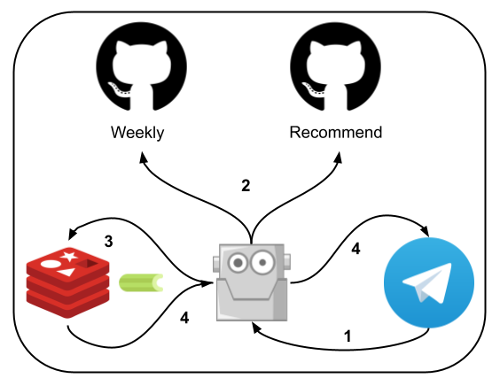

# newsBot
The newsBot is a Telegram chatbot, it will post the [StarBugs weekly](https://github.com/StarBugsWeekly/StarbugsDevOnly) and [recommended article](https://github.com/StarBugsWeekly/recommended_article) to the subscribed Telegram users

## System Diagram

1. Upsert/Delete the subscribed information into/from Redis

2. Check whether GitHub repository update or not

3. If the GitHub repository has new update, generate jobs as Celery task client and put that into Celery broker (Redis)

4. Publish Telegram message as Celery worker from Celery broker (Redis)

## Trigger Point
When one of below conditions meets, the bot will send the message to Telegram channel or user

### Recommended articles publish
When the [recommended article](https://github.com/StarBugsWeekly/recommended_article) PR merge into GitHub repository master branch, the bot will send the recommended articles to Telegram channel or user

### Weekly publich
When the weekly article publish, the bot delivery the weekly article to telegram article

### User ask bot by slash command
When user use the Telegram command `/weekly` or `/recommend`, the bot will send the latest weekly article URL to Telegram channel or user

## Telegram Command
Below command providing the method for user to subscribe and get the latest article from StarBugs

### /help
The `/help` Telegram command shows what Telegram command can be used to inteact with newsBot

### /subscribe
The `/subscribe` Telegram command will upsert the article subscription information into newsBot's database

### /unsubscribe
The `/unsubscribe` Telegram command will delete the article subscription information from newsBot's database

### /weekly (Todo)
The `/weekly` Telegram command let the newsBot to send the latest weekly articles to Telegram channel or user

### /recommend (Todo)
The `/recommend` Telegram command let the newsBot to send the latest recommended articles to Telegram channel or user